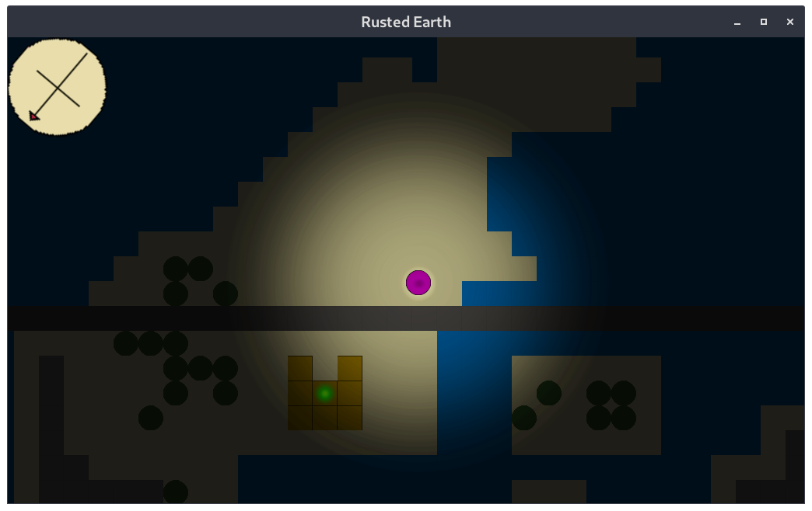
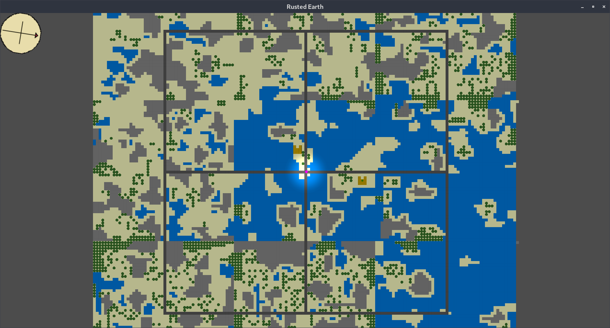
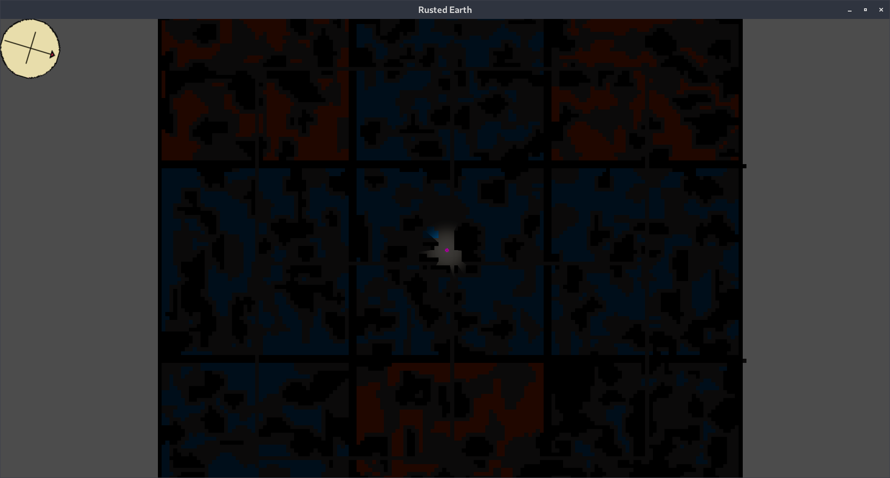

# RustedEarth
Global Game Jam 2020 - game made in 48 hours

## Purpose
This game was used to test/demo Maps-Godot, a rust library for map generation, and show it's limitations and problems.

## Screenshots
Gameplay:

Zoom-out above ground:

Zoom-out underground:


## How To Play 
Warning: due to lack of time and rushed programming this project only works on linux
```
# Download RustedEarth.tar.gz
# tar -xf RustedEarth.tar.gz
# cd RustedEarth
# ./setup.bash
# WASD to move, follow the compass to tge objective until you get underground. The End. :)
```

